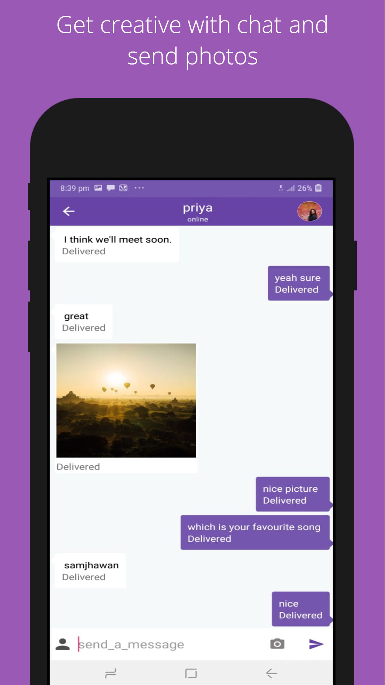

# JusChat
JusChat- A free messaging app to connect with world

### I made this repo a private repository. But, you will soon be able to get Google Play Store link and can use it on your own phone.

  JusChat Messenger is a FREE messaging app available for Android.
UNLIMITED FREE TEXT WITHOUT SHARING NUMBER
Skip exchanging phone numbers and simply send a message to anyone on JusChat app, even if they’re across the world. Enjoy high-quality text messaging on mobile. All you need is good data connection or Wi-fi.
SHARE STORIES
Share story with people on JusChat and watch stories of other people on JusChat. Share your happy moments and thoughts with others.
CLEAR CHAT 
Clear Chat automatically after 24 hours by selecting that option.
SHARE MEDIA 
Share media images with friends on jusChat. Keep your received images private as JusChat don't show them in gallery.
CHECKOUT AND SEE MESSAGE STATUS
Check the status of your message whether your message has been delievered and read.
Chat with Strangers
Check stories of strangers and start connecting with new people.

Install JusChat Free Messenger Now and Start Connecting!
